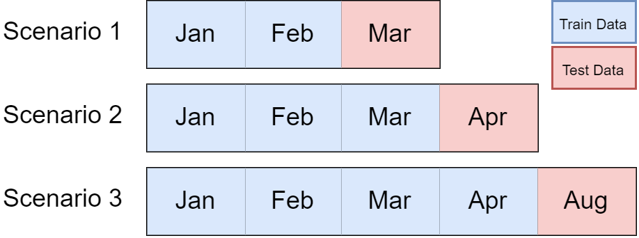
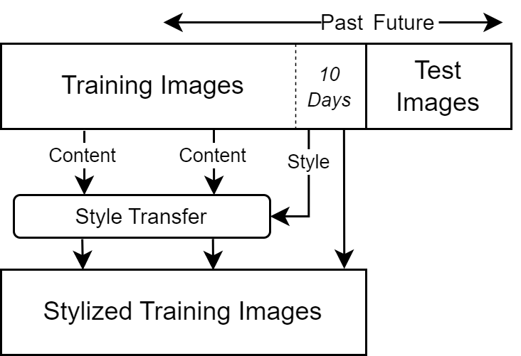
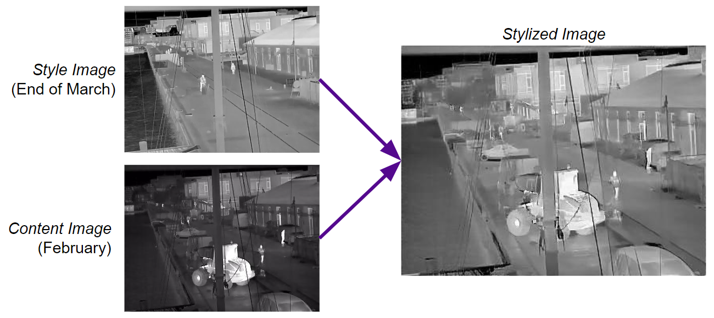
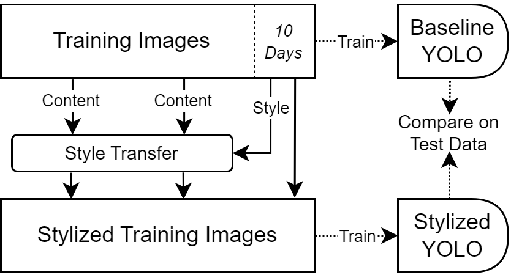

# Mitigating Covariate Shift with Style Transfer
Shuvadeep Saha, Martin Keenan

## Resources

- Style transfer code based on the [Neural Transfer Using Pytorch](https://pytorch.org/tutorials/advanced/neural_style_tutorial.html) tutorial by Alexis Jacq.
- YOLO object detection model based on [yolov5](https://github.com/ultralytics/yolov5) implemented by ultralytics.
- [Long-term Thermal Drift Dataset](https://www.kaggle.com/datasets/ivannikolov/longterm-thermal-drift-dataset) published by [Nikolov et al.](https://openreview.net/forum?id=LjjqegBNtPi).

## Project Description
In goal of this project is to experiment with methods for training object detection models that are robust to data drift. We use the Long-term Thermal Drift Dataset, which is dataset collected across five months from an outdoor thermal-imaging camera mounted on the outside of a building. The dataset includes 651 images annotated with bounding boxes on pedestrians.

Our hypothesis is that using neural style transfer to make older training images look more similar to images taken just before the evaluation period will improve our model's performance. In our experiment we consider three scenarios, shown below, in which we train a model to evaluate on March, April, and August data. (The dataset does not include data for May, June, and July.) In each scenario the training set consists of all images taken during previous months. This simulates a real-world situation where one would only have access to images captured since the camera was deployed.

<p align="center">

</p>

For each scenario, we create a new "stylized" training set. Images from the last ten days of training data are designated as style images and the rest as content images. We apply style to each of the content images by matching each to the style image taken at the closest time-of-day, then apply the neural style transfer algorithm.
<p align="center">

</p>

The figure below shows an example of style transfer from Scenario 2. A style image from the end of March is matched to a content image from February. After style transfer, the new image replaces the February image in the stylized training set.
<p align="center">

</p>

To evaluate whether our methodology adds any value to the model, we then finetune two YOLOv5 pretrained object detection models. The first is trained on the original training set and serves as a baseline. The second is trained on the new stylized training set. We then compare the two models on the same test dataset that includes images from one month after the latest training image.
<p align="center">

</p>

## Repository Description
The code can be divided into two stages: style transfer and object detection. 

The file [stylized_datasets.py](stylized_datasets.py) creates the baseline and style-augmented datasets used for training object detection models. The code for implementing the neural style transfer algorithm is in the [style](style) directory. Examples of the style-augmented datasets are in [datasets](datasets) and [datasets_highstyle](datasets_highstyle).


## Instructions

### Style Transfer
To create the baseline and style-augmented training datasets and the test datasets, first create a new directory that contains a subdirectory with the annotated images from the [Long-term Thermal Drift Dataset](https://www.kaggle.com/datasets/ivannikolov/longterm-thermal-drift-dataset). Then run the following Python command using the path to the new directory.
```
python style_transfer.py --datadir <PATH_TO_DATASET_DIRECTORY> --content_weight 10
```
The `content_weight` option controls the degree of style added to content images by changing the weight of the content loss. For the low-style experiments we set `content_weight` equal to 10 and for the high-style experiments we set it equal to 1.

### Object Detection


## Results

## References

- Jacq, Alexis. “Neural Transfer Using Pytorch.” https://pytorch.org/tutorials/advanced/neural_style_tutorial.html.

- Glenn Jocher, et al., Ultralytics, yolov5: v6.2 - YOLOv5 Classification Models, Reproducibility, ClearML and Deci.ai integrations (v6.2), (2022)
- Nikolov, Ivan Adriyanov, et al. "Seasons in Drift: A Long-Term Thermal Imaging Dataset for Studying Concept Drift." Thirty-fifth Conference on Neural Information Processing Systems, (2021).
- Zheng, Xu, et al. "Stada: Style transfer as data augmentation." arXiv preprint arXiv:1909.01056, (2019).
